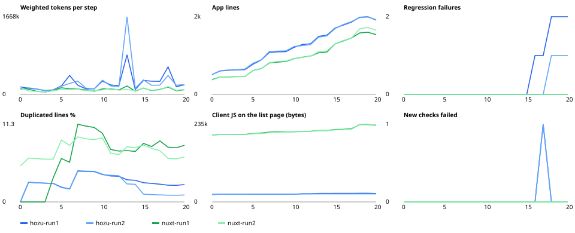

# Trial 0020 — long-run degradation: twenty changes on one codebase (ADR 0042)

**Question:** every earlier trial measured one build plus one change. When fresh agent sessions keep changing the same
notes app twenty times, without memory and without any repair, does the Hozu app degrade more slowly than the Nuxt
app? The criterion was stated before the runs (ADR 0042 F): over steps 1–20, Hozu has fewer regression failures
**and** a lower slope of cost per step against app size.

## Setup
- **Task:** the notes build spec (step 0), then `bench/trial/longrun/changes/01.md … 20.md`, from pin + search to
  removing tags. Each change is behaviour and DOM contracts; later changes touch what earlier ones added (the rename
  in 04 is observed by the export in 19, the route move in 09 by every later path, tags are removed in 20).
- **Acceptance:** `bench/trial/longrun/accept.mjs`, cumulative: after step k it runs every check introduced by steps
  0..k (15 build checks, 64 at step 19, 61 at step 20 after the tag checks retire), split into new and regression.
  Each check signs in its own fresh user.
- **Validated before the agents ran,** on two reference apps written from the change files (Hozu from
  `examples/notes`, Nuxt from the `nuxt-0006` scaffold), both replayed from base + patches by
  `verify-reference.sh`: every step passes 100 % on both. One check was wrong and fixed before any run (A1 / SH1
  counted `<input type=hidden>` as an input that acts on a note). Four deliberate breaks (duplicate text, rate limit
  11, a non-HttpOnly cookie) each turned the expected checks red and left the control checks green.
- **Runs:** Hozu 0.7.0 (packed tarballs, `create-hozu --agent claude`) and Nuxt 4.5.2, `claude-opus-5-5`, one
  `claude -p` session per step with the prompts in `bench/trial/longrun/prompts/`, **two runs per framework**,
  Hozu and Nuxt in parallel. No session-limit voids, no 1800 s timeouts, no browser crashes in the trial runs.
- **Differences from trials 0016–0019:**
  - Node 22.22.1 (22.22.2 is not installed here); pnpm pinned to 10.33.0;
  - `--strict-mcp-config`, so no local MCP servers are loaded;
  - the trial 0016 prompt text was not kept, so the prompts were rewritten from its description;
  - the organisation's managed instructions still reach `claude -p` (they are not a setting source): every agent, in
    both frameworks, ended with a Traditional Chinese summary and three next steps. The output cost is inflated
    equally on both sides, but absolute numbers are not comparable with earlier trials.
- **Data:** `bench/trial/longrun/results/<fw>/<run>/` (acceptance JSON, `hozu check` and `inspect` JSON,
  `metrics.jsonl`, `run.log`). The transcripts (`NN.jsonl`, 22 MB) stay next to them, untracked. The apps, with a
  tag per step, are in `~/hozu-trial-0020/<fw>-<run>/app`.

## Results
**Correctness (steps 1–20):**

| | Hozu run 1 | Hozu run 2 | Nuxt run 1 | Nuxt run 2 |
|---|---|---|---|---|
| New checks failed | 1 (DA1) | 1 (DA1) | 0 | 0 |
| Regression failures (check × step) | 8 | 3 | 0 | 0 |
| First failing step | 16 | 17 | – | – |
| Silent failures (reviewed by hand) | 5 steps (16–20) | 4 steps (17–20) | 0 | 0 |
| `hozu check` / `pnpm typecheck` + `build` | clean at every step | clean at every step | green at every step | green at every step |

**Cost (weighted tokens):**

| | Hozu run 1 | Hozu run 2 | Nuxt run 1 | Nuxt run 2 |
|---|---|---|---|---|
| Build (step 0) | 160 k | 109 k | 135 k | 147 k |
| Changes 1–20, total | 4.91 M | 5.34 M | 2.09 M | 1.93 M |
| Mean / median per change | 245 k / 191 k | 267 k / 188 k | 105 k / 104 k | 97 k / 94 k |
| Mean, steps 1–10 → 11–20 | 173 k → 317 k (+83 %) | 168 k → 367 k (+118 %) | 97 k → 112 k (+15 %) | 85 k → 108 k (+27 %) |
| Slope of cost per step | +11.7 k | +12.5 k | +1.2 k | +2.3 k |
| Slope of cost per 100 app lines | +17.8 k | +18.3 k | +2.3 k | +3.8 k |
| Calls, steps 1–20 | 483 | 494 | 233 | 214 |

**Per step (mean of the two runs):**

| Step | Change | Hozu | Nuxt | Ratio | Calls H / N |
|---|---|---|---|---|---|
| 0 | build | 135 k | 141 k | 1.0× | 15 / 11 |
| 1 | pin + search | 137 k | 94 k | 1.5× | 16 / 12 |
| 2 | max 60 | 116 k | 64 k | 1.8× | 16 / 10 |
| 3 | timestamp | 82 k | 53 k | 1.5× | 11 / 7 |
| 4 | rename | 90 k | 82 k | 1.1× | 12 / 10 |
| 5 | edit in place | 179 k | 123 k | 1.5× | 20 / 12 |
| 6 | tags | 321 k | 111 k | 2.9× | 34 / 12 |
| 7 | archive | 241 k | 113 k | 2.1× | 24 / 10 |
| 8 | search in the URL | 125 k | 85 k | 1.5× | 14 / 12 |
| 9 | move to `/notes` | 119 k | 76 k | 1.6× | 15 / 9 |
| 10 | undo | 295 k | 107 k | 2.7× | 32 / 11 |
| 11 | load more | 193 k | 125 k | 1.5× | 18 / 14 |
| 12 | instant add | 176 k | 93 k | 1.9× | 22 / 11 |
| 13 | bulk actions | 1 259 k | 142 k | **8.9×** | 80 / 14 |
| 14 | rate limit | 118 k | 74 k | 1.6× | 16 / 9 |
| 15 | sharing | 306 k | 133 k | 2.3× | 27 / 12 |
| 16 | admin page | 239 k | 85 k | 2.8× | 24 / 9 |
| 17 | delete account | 240 k | 103 k | 2.3× | 26 / 10 |
| 18 | German | 499 k | 163 k | 3.1× | 39 / 15 |
| 19 | export | 182 k | 83 k | 2.2× | 23 / 11 |
| 20 | remove tags | 209 k | 104 k | 2.0× | 22 / 12 |

**Codebase (step 20; slopes over steps 1–20):**

| | Hozu run 1 | Hozu run 2 | Nuxt run 1 | Nuxt run 2 |
|---|---|---|---|---|
| App lines | 1 671 (+71.5 / step) | 1 681 (+70.5) | 1 344 (+57.6) | 1 444 (+61.7) |
| Duplicated lines, final (peak) | 2.5 % (4.5 %) | 1.0 % (4.4 %) | 8.2 % (11.3 %) | 6.5 % (9.5 %) |
| Client JS on the list page, step 0 → 20 | 22.6 → 25.6 KB | 22.6 → 24.1 KB | 202 → 232 KB | 202 → 233 KB |
| Hozu: lock entries / changed over the run | 71 / 93 | 70 / 97 | | |
| Hozu: states / transitions at step 20 | 16 / 71 | 16 / 70 | | |
| Hozu: unreachable states / `--update-lock` runs over the run | 0 / 15 | 0 / 11 | | |

JS is the uncompressed size of the scripts loaded. `/login` and the list page load the same Hozu bundle.

**Where the calls go (mean per change, `anatomy.mjs`):**

| | Edit | Verify | Read app | Docs | Check | Carried cost of docs + reading |
|---|---|---|---|---|---|---|
| Hozu | 6.4 | 7.5 | 4.0 | 3.5 | 1.1 | 71 k |
| Nuxt | 2.7 | 2.0 | 2.1 | 0 | 2.3 | 19 k |

## Reading the result
**The thesis does not hold on this task.** Both pre-stated criteria go to Nuxt:
- Nuxt made twenty changes twice without a single regression or failed new check.
- Hozu's cost per change doubled from the first half to the second, while Nuxt's rose by 15–27 %.

**The Hozu regressions come from two mechanisms, both outside the IR, both found in the reference app first:**

| Failure | Runs | Root cause |
|---|---|---|
| DA1: a deleted account reappears in the admin table (step 17 on) | both | **D9 (new):** with JS, the deleting page refetches its `live` queries on the tag message before the mutation's response clears the cookie. The request carries the old session, and a resolver that creates a user's list on read brings the user back. With the same app and JS off, DA1 passes. |
| N15: Chrome logs "Transition was aborted … ViewTransition opt-in disabled" (step 16 on) | run 1 | **D7:** a page cannot answer 403, so `/admin` was hand-written HTML from an endpoint without the `@view-transition` rule the framework pages carry. |

- **Both are silent.** In both runs the step-17 agent wrote that the admin table no longer lists the deleted user. It
  had checked with `curl`, and without JS the bug does not occur. `hozu check` stayed clean at every step: neither
  failure is in anything the validator sees (an endpoint's HTML, resolver state, a client/server race).
- **The cost spikes are the framework gaps of the reference app (`bench/trial/longrun/reference/hozu-defects.md`):**
  - step 13, bulk actions, 851 k and 1 668 k (47 edits in one run): D3, forms cannot send several checked values or
    tell two submit buttons apart, so both agents built a native form and an endpoint;
  - step 18, German, 591 k / 407 k: D8, i18n prefixes every locale, English included; neither run used
    `site.locales`, both built their own language switch;
  - step 6, tags, 407 k / 235 k: D1, a `search` schema on a route changes every `navigate` link, and HZ018 fires with
    identical `was` / `now` (both runs edited the account machine's navigation in this step, and HZ018 appears 4 times
    in each transcript);
  - step 10, undo, 285 k / 305 k: 13 and 11 verify calls; the cause was not analysed further.
- **The fixed cost of the guide stays:** Hozu agents read 3.5 docs topics per change and verify 3.7× as often
  (`hozu get` / `post` / `browse`), and that context is carried through every later call.

**What Hozu does better, and keeps better, as the codebase grows:**
- **Duplication stays low and flat** (1–2.5 % at the end, against 6.5–8.2 %). In both Nuxt runs the jump comes with
  step 5 (edit) and step 7 (archive); which blocks repeat was not analysed.
- **Client JS stays an order of magnitude smaller and grows 10–20× more slowly** (+1.5 to +3 KB over twenty changes,
  against +30 KB).
- **The structure stays checkable:** 70–71 lock entries, 16 states and 70–71 transitions at the end, no unreachable
  state, every deciding transition covered by a contract, `hozu check` clean at every step.
- None of this turned into fewer regressions or a cheaper change: the app is larger (1.2× Nuxt's lines), and the cost
  per change rises with it.

## What the data does not show
- **Two runs per framework, one task, one model.** The per-step spread between runs is large (Hozu step 13: 851 k and
  1 668 k), so single steps are not significant. The direction of every aggregate is the same in both runs.
- **The change set is ours.** It was written without looking at either framework, but it contains exactly the kinds
  of change that meet Hozu's current gaps (403, multi-value forms, cross-user data, a second language). A change set
  that stays inside Hozu's supported surface could show a different result, and would also be a weaker test.
- **The agents' prior knowledge is not equal:** Nuxt is in the model's training data, and Hozu is learned from the
  guide each session. That is part of what is measured, not a flaw of the measurement.
- **"Degradation" here is behaviour and cost.** Readability, reviewability and the effort a human needs to verify a
  change are not measured. The lock, the contracts and the render plan are aimed at those.
- **Silent failures were classified by hand** for the failing steps. The automatic heuristic cannot read the
  summaries' intent (they are in Chinese and always list limitations).
- **The managed organisation instructions** changed every agent's final message. The effect is equal on both sides,
  but it adds output tokens.

## Conclusion
- **Over twenty sequential changes, Nuxt stayed correct and flat in cost.** Hozu 0.7 stayed structurally clean, with
  low duplication and 10× less client JS, but its cost per change doubled, and from step 16–17 on both runs carried
  regressions that the agents reported as working.
- **The claim "AI-generated codebases degrade more slowly under Hozu" is not supported by this trial.**
- **The measured degradation is concentrated where an app has to leave Hozu's surface:** 403 pages, multi-value
  forms, cross-user invalidation, an unprefixed default locale. In those places the agent writes endpoints and
  hand-made HTML that no validator checks, and they are where both the regressions and the largest costs are.
- **Candidates for the next phase, by measured effect:**
  - D9 + D4: cross-session and endpoint invalidation, and live refetch racing a session change (the only regression
    seen in both runs);
  - D3: multi-value form fields and the submitter (step 13, 8.9× Nuxt);
  - D7: a 403 from a page (a regression in run 1, and an endpoint page outside the IR);
  - D8: a second locale without prefixing the default (step 18, 3.1×);
  - D1 / D6: HZ018 printing identical `was` / `now` (steps 6, 10, 14).
- **Re-measure after fixes:** steps 13–20 on the step-12 commits of these apps (about an hour per run), with the same
  acceptance.
