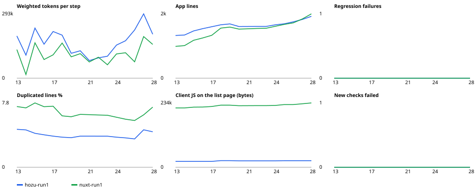

# Trial 0021 — 0.8 on the long run: steps 13–28 of the notes app (ADR 0043, ADR 0044)

**Question:** trial 0020 found that Hozu 0.7 degraded under twenty sequential changes:
- silent regressions from step 16–17;
- a cost per change that doubled;
- a clean `hozu check` at every failing step.

ADR 0043 is the breaking 0.8.0 that answers it. Does 0.8 remove what was measured, on the same apps and on eight
changes nobody designing 0.8 saw?

**Why Nuxt:** Nuxt is the model's home ground. It is in the training data, while Hozu is learned from the guide in
every session. The same model, spec and hidden acceptance are used for both, so the cost ratio mostly measures that
learning (ADR 0038). Trial 0024 (ADR 0055) separates learning cost from structural cost.

## Setup
- **Apps:**
  - Hozu: trial 0020 run 1 at step 12, upgraded with `hozu migrate 0.8` (`s12m`). The stale-under-0.7 review was
    recorded; run 1 had no stale entry.
  - Nuxt: trial 0020 run 1 at step 12, unchanged, re-run at the same time as the drift control.
  - Both apps are clones in `~/hozu-trial-0021`; trial 0020's apps are untouched.
- **Changes:** 13–20 as in trial 0020. 21–28 are held out:
  - written by an isolated session that saw neither 0.8 nor the research, and sealed by SHA-256
    (`bench/trial/longrun/heldout.sha256`);
  - validated at 100 % on a Nuxt reference and on a 0.8 Hozu reference;
  - no check was amended.
- **Everything else as trial 0020:**
  - one `claude -p` session per step, `claude-opus-5-5`, the same prompts;
  - never repaired between steps;
  - two apps at a time.
  - No session-limit void and no timeout in this trial.
- **Packages:** 0.8.0 tarballs packed from `v0.8` at `12f7e6f`, frozen before the runs.
- **Deviation (owner, ADR 0044):** one run per framework instead of three, and no short variant. Everything below is
  n = 1. A result near a threshold is read as undecided.
- **Harness:** `SESSION_SECRET` is provided by the runner to the agent and to the acceptance server, because 0.8
  refuses production without it. The app itself holds no secret.
- **Instructions:** fingerprints were recorded per step (`results-0021/*/run1/fingerprints.jsonl`); the user, app, prompt
  and skill hashes are identical at all 16 steps of each app. The organisation's
  managed instructions are injected server-side and could not be fingerprinted, as in trial 0020.
- **Data:** `bench/trial/longrun/results-0021/`. The transcripts stay untracked next to them.

## Results
**Correctness: every step of both apps passes 100 %, new and regression.**

| | Steps 13–20 | Held out 21–28 |
|---|---|---|
| Hozu 0.8: checks passed | 54/54 … 64/64, every step | 66/66 … 80/80, every step |
| Nuxt: checks passed | the same counts, every step | the same counts, every step |
| Regression failures / silent introductions, Hozu | 0 / 0 (0.7 run 1: 8 failures, silent at 5 steps) | 0 / 0 |

- **DA1** (the deleted account that came back), **N15** (the console error on `/admin`) and the new DA1b / B3b / N16
  checks all passed at every step.
- **Step 16's admin page** is `head.failed: { Forbidden: 403 }` with a view. There is no hand-written HTML endpoint;
  that was D7's detour in 0.7.
- **`hozu check`:**
  - clean at every step (0 errors, 1 HZ058 warning carried from `s12m`);
  - 0 HZ018;
  - the lock equals the computed lock at every committed step (0 new entries left out, 0 changed without a
    contract).

**Cost (weighted tokens):**

| | Hozu 0.8 | Nuxt | Ratio | 0.7 ratio (trial 0020 run 1 / run 2) |
|---|---|---|---|---|
| Step 13, bulk actions | 192 k | 130 k | 1.48× | 8.9× (851 k, 1 668 k) |
| Step 14 | 105 k | see note | 0.85× corrected | 1.59× |
| Step 16, admin page | 155 k | 85 k | 1.82× | 2.8× |
| Step 18, German | 196 k | 160 k | 1.23× (1.20× its neighbours' mean) | 3.1× |
| Step 19, export | 113 k | 97 k | 1.17× | 2.19× |
| Geometric mean, steps 13–20 | | | **1.34×** corrected (1.72× uncorrected) | 2.64× / 2.73× |
| Geometric mean, held out 21–28 | | | **1.46×** | — |

- **Note on Nuxt step 14:**
  - The session's final `result` record counted only its last two turns: 16.7 k for 15 calls.
  - The message-level sum for that step is 82.5 k. Scaled by Nuxt's median result-to-message ratio (1.50), it is
    123.5 k.
  - The table uses the corrected value. The uncorrected figure, and the generated chart that uses it, are shown for
    completeness.
  - Computing every step at message level instead gives 1.54× (13–20) and 1.68× (21–28).
- **Calls over steps 13–28:**
  - Hozu 270 against Nuxt 193;
  - verify or serve calls 82 against 39;
  - Hozu read the guide in 42 turns, Nuxt in none.

**Codebase (step 28):**

| | Hozu 0.8 | Nuxt |
|---|---|---|
| App lines | 1 839 (+27.6 per step) | 1 912 (+52.7 per step) |
| Duplicated lines | 4.3 % (3.5–4.6 % over the run) | 7.3 % (5.7–7.8 %) |
| Client JS on the list page | 24.0 KB (+193 B per step) | 233.9 KB (+980 B per step) |

The chart is generated by `report.mjs` from the raw records, so it shows Nuxt step 14 at its undercounted value.

## Reading the result
**Against the registered targets (ADR 0044):**

| Target | Result | Verdict |
|---|---|---|
| No regression, no silent introduction in steps 13–28 | 0 and 0 | met |
| Geometric-mean ratio 13–20 ≤ 1.8× | 1.34× corrected; 1.54× message-level; 1.72× uncorrected | met in every accounting |
| Step 13 ≤ 2× | 1.48× | met |
| Step 14 ≤ 1.25× | 0.85× corrected, 1.02× message-level | met (n = 1, and Nuxt's record had to be corrected) |
| Step 19 ≤ 1.4× | 1.17× | met |
| Step 18 ≤ 1.3× its neighbours | 1.20× | met |
| No hand-written HTML endpoint in step 16 | none | met |
| Mutation recall 100 % | not run | not measured |
| Thesis: log-ratio slope over 13–28 ≤ 0 | +0.015 corrected, +0.014 message-level (−0.023 uncorrected) | **not met**: the ratio grows by about 1.5 % per step |

**What changed from 0.7:**
- The two mechanisms behind every 0.7 regression are gone:
  - the session-change race behind DA1, by B and the scaffold's read-only queries;
  - hand-written HTML pages, by D's `head.failed`.
- Their checks passed with and without JS at every step.
- The three cost spikes of 0.7 fell to the Nuxt range: bulk actions 8.9× → 1.48×, German 3.1× → 1.23×, the admin page
  2.8× → 1.82×. Each was a framework gap that ADR 0043 closed (C, F, D).
- Hozu's code grew half as fast as Nuxt's (27.6 against 52.7 lines per step); in trial 0020 the 0.7 app ended 1.2×
  Nuxt's size. Step 28 is 1 839 lines against 1 912. Which forms account for it was not analysed.
- Duplication and client JS kept their 0.7 advantage.

**What did not change:**
- Hozu still makes more calls per change (270 against 193) and verifies twice as often. The guide is still read every
  session (42 docs turns against 0).
- The ratio does not fall over the run. On the held-out steps it is 1.46×, a little above the 1.34× of 13–20, and the
  corrected slope is slightly positive. 0.8 is cheaper per change everywhere, but its cost still grows a little faster
  with the codebase than Nuxt's.

## What the data does not show
- **One run.** The per-step spread between runs was large in trial 0020 (Hozu step 13: 851 k and 1 668 k). Single steps (14, 16) are not
  significant, and a second and third run (run 2's `s12m` is tagged) would decide the slope.
- **The step-14 correction.** It rests on Nuxt's median result-to-message ratio. The verdicts above hold in all three
  accountings, except the slope, which is negative only in the uncorrected one.
- **The mutation tests registered in ADR 0044 were not written.** The claim that 0.8's checks catch D3 / D4 / D7 / D9
  rests on the wave repro tests (each seen red on 0.7 and green on 0.8), not on planted defects.
- **A fresh 0.8 build** (the short variant, steps 0–7) was not run, so SKILL.md's effect on building an app is not
  measured.
- **Contamination:** the coordinator saw a one-line summary of each held-out change before sealing them, but did not
  read the changes or their checks. The held-out author, the validators and the agents never saw the research.
- **The managed instructions** shaped every agent's final message in both frameworks, as in trial 0020.

## Conclusion
- **0.8 removed what trial 0020 measured:**
  - no regression and no silent failure over sixteen changes, eight of them unseen;
  - every targeted cost spike back in the Nuxt range;
  - a geometric-mean cost ratio of 1.34× (corrected; 1.54–1.72× in the other accountings), against 2.64–2.73× for 0.7.
- **ADR 0042's thesis is still not supported:** with one run, Hozu's cost ratio grows slightly over the run rather than
  falling.
- **The largest remaining difference is the fixed cost of a change:** guide reads and verification calls. That is the
  next lever, not correctness.
